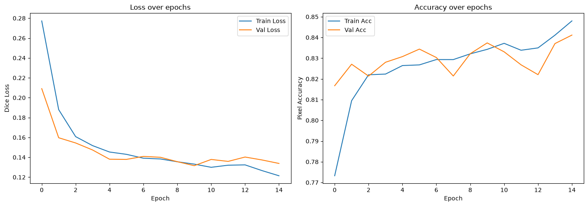
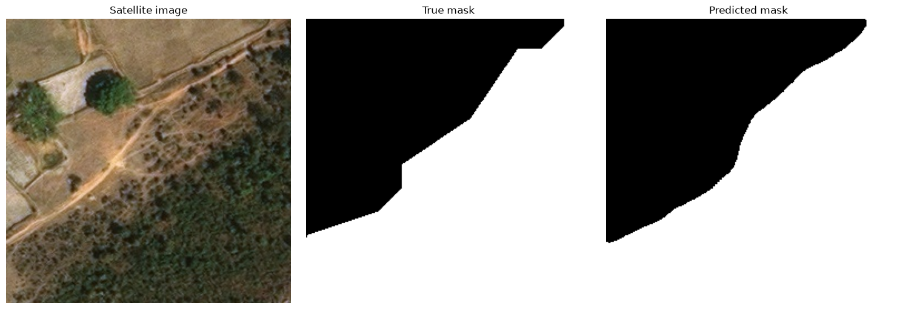

# Forest Segmentation from Aerial Imagery

A deep learning project that trains a U-Net to segment forest cover from aerial imagery, built as a self-directed extension from my university Machine Learning and Deep Learning coursework and taught material.

## Overview

This project has two parts. 

The first (`00_refresher.ipynb`) rebuilds core PyTorch and CNN fundamentals - training loops, evaluation, data augmentation - using Fashion-MNIST, refreshing concepts from my Deep Learning module's classic MNIST coursework. 

The second (`01_forest_exploration.ipynb`) is the main project: a full binary semantic segmentation pipeline using a U-Net with a pretrained ResNet34 encoder, trained to distinguish forest from non-forest pixels in aerial imagery.

Beyond building a working model, I aimed to practice the full ML project lifecycle: data exploration and validation, informed architecture/loss choices, iterative experimentation (learning rate scheduling, color augmentation), and honest evaluation of the model's real limitations on genuinely external data.

## Dataset

- **Part 1 (refresher):** [Fashion-MNIST](https://www.kaggle.com/datasets/zalando-research/fashionmnist) -> 70,000 28×28 grayscale clothing images across 10 classes.
- **Part 2 (main project):** [Forest Aerial Images for Segmentation](https://www.kaggle.com/datasets/quadeer15sh/augmented-forest-segmentation/data) (Kaggle) -> 5,108 RGB 256×256 aerial images paired with binary forest/non-forest masks.

Both datasets were sourced from Kaggle; download instructions are in [Setup](#setup--how-to-run) below.

**Note on label quality:** during exploration, I identified and verified label noise affecting a subset of images (e.g. the `3484_sat_*` range), where masks appear misaligned with their corresponding images - [see Limitations](#limitations--future-work) for details.

## Setup / How to Run

1. Clone this repository
2. Create and activate a virtual environment:
```bash
    python3 -m venv venve
    source venv/bin/activate # Windows: venv/Scripts/activate  
```
3. Install dependencies:
```bash
    pip install -r requirements.txt
```
4. Download the datasets from Kaggle (links above) and extract into 'data/' folder (see structure below)
5. See working code in `notebooks/00_refresher.ipynb` and `notebooks/01_forest_exploration.ipynb`.  

# Project Structure

- `data/`  -> Contains all datasets used in the project.

- `models/` -> Saved and trained machine learning models.    

- `notebooks/` -> Jupyter notebooks created

    - `00_refresher.ipynb` -> Fashion MNIST refresher

    - `01_forest_exploration.ipynb` -> satellite imagery model code      

- `.gitignore` -> Specifies untracked files to ignore (e.g., checkpoints, local data).

- `LICENSE` -> Legal license and usage rights for this repository.

- `requirements.txt` -> Project dependencies and required packages.

- `README.md` -> Top-level project documentation.

## Methodology / Approach

### Data Pipeline

The forest satellite imagery dataset contains 5,108 RGB images (256x256) paired with a binary forest/non-forest mask (traced image with white forest vs black non-forest). Before building any model, I explored the raw data directly, while doing so some key decisions I made include:

- Masks were stored as JPEGs, which introduced minor compression artifacts (a spread of near-0 and near-255 values rather than clean binary values). Converting masks to grayscale and thresholding at the midpoint (`>= 128`) recovered the needed clean binary labels.

- I built a custom PyTorch `Dataset` class rather than relying on `torchvision.transforms.Compose` directly, because segmentation requires image and mask to receive **identical** spatial augmentations (flips, rotations). `Compose` applies transforms independently to each image and could silently desynchronize image/mask pairs if not stated properly. I used the same random draw to apply matching horizontal/vertical flips and 90° increment rotations to both. I restricted rotation to 90° increments specifically to avoid the black corner artifacts that arbitrary-angle rotation introduce on square images, which would otherwise inject false "non-forest" labels at the rotated edges.

- Since aerial imagery has no canonical "up" (unlike ground-level photos), I used the full range of flips and rotations as valid augmentations.

- Train/validation split (80/20) was performed on the metadata table **before** constructing dataset objects, ensuring no image or its augmented variant could leak across the split boundary.

### Model

I used a U-Net architecture (via `segmentation-models-pytorch`) with a ResNet34 encoder pretrained on ImageNet. Rather than implementing U-Net from scratch, I chose to build on this library so I could focus my time on understanding and correctly implementing the training loop, loss design, and evaluation (a transfer learning approach).

### Loss Function & Metrics

Given the per-image class imbalance, I used **Dice loss** rather than pixel-wise cross-entropy or plain accuracy. Dice directly measures the overlap between predicted and true regions, regardless of how large or small that region is. An image that's 0.2% forest would let a model naively predicting "no forest anywhere" score near-perfect pixel accuracy while being completely useless.

I tracked pixel accuracy alongside Dice as a diagnostic check, to see if accuracy stayed high while Dice stagnated, indicating the model had collapsed into predicting the majority class.

### Training Strategy

- **Optimizer:** Adam with a reduced learning rate (starting at 1e-4, later to 1e-5 after scheduling). Using a smaller rate protects pretrained encoder weights from being aggressively overwritten early in training.

- **Learning rate scheduling:** I added `ReduceLROnPlateau`, which halves the learning rate when validation loss stalls for 2 consecutive epochs. Motivated directly by earlier training runs in the project where I observed validation loss plateauing and mildly worsening past multiple epochs while training loss kept improving -> a sign the fixed learning rate had become too coarse for further gains.

- **Early stopping:** training halts automatically after 5 consecutive epochs without validation improvement, preventing wasted compute and mitigating overfitting risk.

- **Checkpointing:** the model is saved to disk only when validation loss improves, ensuring the final saved model reflects the genuine best achieved performance.

- **Weight decay** (1e-5) was added as a mild regularizer alongside the scheduler.

### Experimentation

- Adding color jitter augmentation (brightness/contrast/saturation) to test whether the model's real-world generalization to differently-lit/colored external images could be improved.

## Results

Across multiple training runs, the model reached validation Dice scores ranging from **~0.84 to ~0.879** depending on random initialization, data shuffling, and augmentations. The example run below reached a validation Dice of ~0.84 (val loss 0.1338):





I tested the model further on real-world aerial images from outside the training dataset (rivers, mixed vegetation, a wildfire scene) — results were mixed, revealing interesting strengths (boundary/shape detection) and weaknesses (color/lighting sensitivity). Full findings are in [Limitations & Future Work](#limitations--future-work).

If you think the model can be improved or there are some areas you want to tinker/experiment with then you are more than welcome to clone this repo and see what works. I'd genuinely be curious!

## Limitations & Future Work

During this project there were some concerns with the data and observations I would like to mention.   

**Label noise in the source data.** A subset of images (e.g. the `3484_sat_*` range) have masks that don't reliably match their corresponding images. This was also flagged independently by other users of the dataset on Kaggle. I didn't filter these out for this baseline, but identifying and excluding them is a natural next step.

**Domain shift on external images.** Testing on aerial images from outside the training dataset showed a real split in how well the model generalizes: boundary and shape detection (roads, burnt-forest edges) held up reasonably well, but performance was noticeably sensitive to color and lighting conditions not well represented in the training data. This was likely due to the training set comeing from a single source with fairly uniform color characteristics. I tried addressing this with color jitter augmentation, which helped in some cases (better shadow/lake boundary detection) but not others (extreme saturation, water-adjacent forest).

**No distinct classes (example: water, sand, road, etc..).** The dataset only labels forest vs. non-forest, so the model has never explicitly learned to recognize specific features. Adding distinct classes (with new labels) would be an interesting approach to explore more images/scenarios and identify any confusion in the models assumptions.

**Run-to-run variance.** Validation Dice varied meaningfully across otherwise-identical training runs (~0.84 to ~0.879), due to random initialization, shuffling, and augmentation. 

**Possible next steps**:

- Filter or relabel the known noisy images and compare results

- Try a different encoder (e.g. `efficientnet-b4`) or compare against a from-scratch U-Net implementation

- Extend to multispectral satellite data (e.g. Sentinel-2) rather than RGB aerial imagery

- Add new labeled data, directly targeting the generalization gap found in testing

## License

This project is licensed under the MIT License — see the LICENSE file for details.